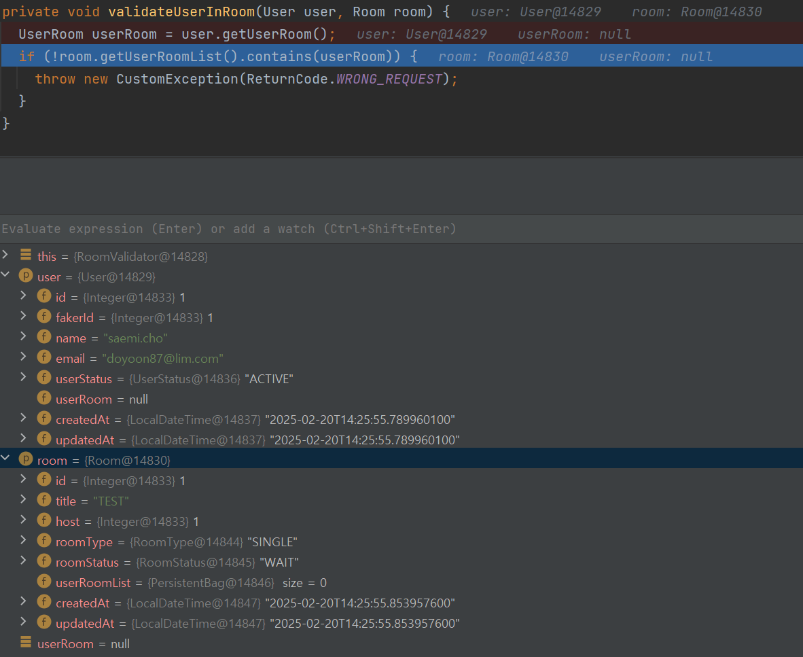
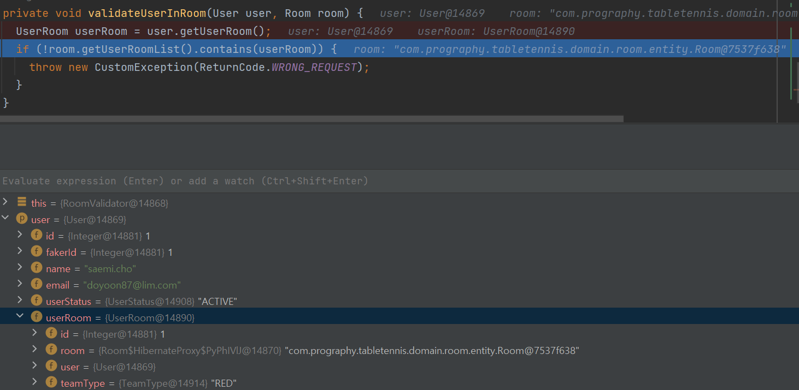
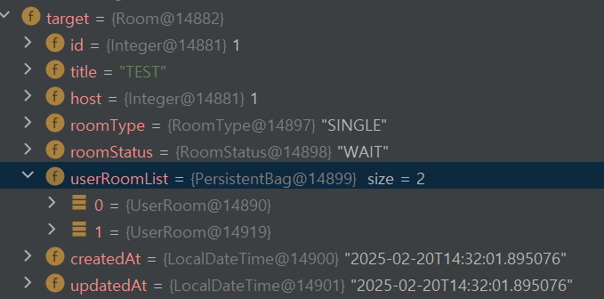
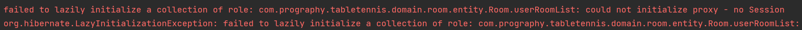
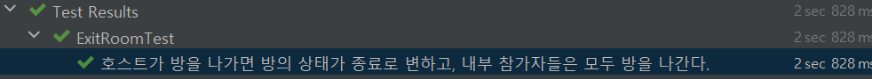

# 프로그라피 과제 수행 (Table Tennis)

### ✨ 구현 기능 명세

1. 공통 API Response

- [X] 요청이 성공했을 때, code = 200, message = "API 요청이 성공했습니다." 를 반환합니다.
- [X] 잘못된 API 요청은 code = 201, message = "불가능한 요청입니다." 를 반환합니다.
- [X] 서버 에러가 발생하는 케이스는 code = 500, message = "에러가 발생했습니다." 를 반환합니다.
- [X] result가 존재하지 않을 때는, code와 message만 출력합니다.

2. 헬스체크 API

- [X] 정상적인 서버 상태일 경우, code = 200, message = "API 요청이 성공했습니다." 를 반환합니다.

3. 초기화 API

- [X] 기존에 존재하는 테이블의 모든 컬럼을 우선 삭제합니다.
- [X] Seed, Quantity에 맞춰 Faker API 응답 결과를 파싱합니다.
- [X] Faker 응답 결과는 다음 원칙에 맞춰 User로 변경합니다.
    - [X] 응답 값의 id필드는 fakerId로 저장합니다.
    - [X] 응답 값의 id(fakerId)를 오름차순으로 정렬하여 데이터를 저장합니다.
    - [X] username 필드는 name으로 저장합니다.
    - [X] email 필드는 그대로 저장합니다.
    - [X] 응답 값의 id(fakerId) 값이 30 이하의 회원은 활성(ACTIVE) 상태로 세팅합니다.
    - [X] 응답 값의 id(fakerId) 값이 31 이상, 60 이하의 회원은 대기(WAIT) 상태로 세팅합니다.
    - [X] 응답 값의 id(fakerId) 값이 61 이상인 회원은 비활성(NON_ACTIVE) 상태로 세팅합니다.
- [X] 데이터가 저장되는 시점에 따라 createdAt과 updatedAt을 저장합니다.

4. 유저 전체 조회 API

- [X] 유저의 모든 회원정보를 id 오름차순 기준으로 페이징에 맞춰 조회합니다.

5. 방 생성 API

- [X] 방 정보는 RequestBody에 담아 요청합니다.
- [X] 다음과 같은 조건을 모두 만족하는 경우 저장이 가능합니다
    - [X] User의 Status는 ACTIVE이다.
    - [X] User는 어떤 방에도 속해 있지 않다.
- [X] 조건을 만족하지 않는 경우, 201 응답을 반환합니다.
- [X] 데이터가 저장되는 시점에 따라 createdAt과 updatedAt을 저장합니다.

6. 방 전체 조회 API

- [X] 방의 정보를 id 오름차순 기준으로 페이징에 맞춰 조회합니다

7. 방 상세 조회 API

- [X] 특정 Room Id를 가진 방의 모든 정보를 조회합니다.
- [X] 해당 방이 존재하지 않는 경우, 201 응답을 반환합니다.

8. 방 참가 API

- [X] 유저 정보는 RequestBody에 담아 요청합니다.
- [X] 다음과 같은 조건을 모두 만족하는 경우 참가가 가능합니다.
    - [X] User의 Status는 ACTIVE이다.
    - [X] User는 어떤 방에도 속해 있지 않다.
    - [X] Room의 정원이 미달이다.
    - [X] Room의 Status는 WAIT이다.
- [X] 조건을 만족하지 않는 경우, 201 응답을 반환합니다.
- [X] 해당하는 방 혹은 유저가 존재하지 않는 경우, 201 응답을 반환합니다.

9. 방 나가기 API

- [X] 유저 정보는 RequestBody에 담아 요청합니다.
- [X] 다음과 같은 조건을 모두 만족하는 경우 방 나가기가 가능합니다.
    - [X] User는 해당 방에 참가한 상태이다.
    - [X] Room의 Status는 WAIT이다.
- [X] 조건을 만족하지 않는 경우, 201 응답을 반환합니다.
- [X] 해당하는 방 혹은 유저가 존재하지 않는 경우, 201 응답을 반환합니다.
- [X] Host가 방을 나가게 될 경우, 방에 존재하는 모든 인원이 나가게 됩니다.
- [X] Host가 방을 나가게 될 경우, 방은 FINISH 상태로 변합니다.

10. 게임시작 API

- [X] 유저 정보는 RequestBody에 담아 요청합니다.
- [X] 다음과 같은 조건을 모두 만족하는 경우 게임 시작이 가능합니다.
    - [X] User는 해당 방에 참가한 상태이다.
    - [X] Room의 Status는 WAIT이다.
    - [X] Room의 정원이 모두 차있고, RED-BLUE 팀원 수가 정확히 반반이다.
    - [X] User는 해당 방의 Host이다.
- [X] 조건을 만족하지 않는 경우, 201 응답을 반환합니다.
- [X] 해당하는 방 혹은 유저가 존재하지 않는 경우, 201 응답을 반환합니다.
- [X] 게임 시작이 가능한 경우, 방의 상태를 PROGRESS로 변경한다.
- [X] 게임 시작이 된 방은 1분 뒤 종료 상태로 변경되며 참여자들은 모두 ACTIVE 상태가 된다.


11. 팀 변경 API

- [X] 유저 정보는 RequestBody에 담아 요청합니다.
- [X] 다음과 같은 조건을 모두 만족하는 경우 팀 변경이 가능합니다.
    - [X] User는 해당 방에 참가한 상태이다.
    - [X] Room의 Status는 WAIT이다.
    - [X] 반대 팀에는 빈 정원이 1자리 이상 있어야 한다.
- [X] 조건을 만족하지 않는 경우, 201 응답을 반환합니다.
- [X] 해당하는 방 혹은 유저가 존재하지 않는 경우, 201 응답을 반환합니다.
- [X] 게임 시작이 가능한 경우, 방의 상태를 PROGRESS로 변경한다.
- [X] 게임 시작이 된 방은 1분 뒤 종료 상태로 변경되며 참여자들은 모두 ACTIVE 상태가 된다.

<br>

### 💻 커밋 컨벤션

> [**AngularJS 커밋 컨벤션**](https://gist.github.com/stephenparish/9941e89d80e2bc58a153) 참고

| Type     | Description      |
|----------|------------------|
| feat     | 새로운 기능 추가        |
| fix      | 버그 수정            |
| docs     | 문서 변경            |
| style    | 코드 포맷 변경         |
| refactor | 코드 리팩토링          |
| test     | 테스트 추가 및 수정      |
| chore    | 빌드 작업 및 도구 관련 변경 |

<br>

### ❓ 구현 과정에서 고민했던 부분

**1️⃣ 게임 시작이 된 방을 1분뒤 종료 상태로 변경하는 설계**

**(1) 요청 쓰레드에서 Thread.sleep() 을 사용하여 60초간 대기한다.**

- 트랜잭션이 보장될 수 있음
- 응답 속도가 비정상적

**(2) 새로운 쓰레드를 비동기적으로 실행하고, 요청 쓰레드의 블락을 피한다.**

- Spring에서 제공하는 TaskScheduler 사용 (권장)
- Java에서 제공하는 ScheduledExecutorService 사용

ScheduledExecutorService 만큼의 저수준의 스케줄링 제어의 필요성을 느끼지 못했고,
스프링 환경 위에선 빈 기반 TaskScheduler를 사용하는 것이 자연스럽다고 생각했습니다.

**(3) 1~5초 이내 간격으로 배치 작업 수행**

스케줄러를 통해 방의 상태가 PROGRESS이며, 컬럼 update_at이 1분 이상 경과한 컬럼들을 모두 조회하여,
상태를 업데이트 해주는 방법

- TaskScheduler보다 많은 요청 처리 가능
- DB 조회가 늘어나, 무리가 갈 수 있음 (Index 추가, Redis 사용 고려)

<br>

결과적으로 단순 과제에선 구현의 간결성을 위해  **(2) 스프링 TaskScheduler를 사용한 비동기 작업** 방식을 선택했습니다.

단, 트랜잭션 외부에서 실행되는 비동기 작업이므로, 작업 실행 전후에 Room 및 관련 엔티티 상태가 변경될 가능성에 주의를 기울일 것 같습니다.

<br>

**2️⃣ 통합 테스트에서 @Transactional을 제거한 이유**

```
  @Test
  @DisplayName("호스트가 방을 나가면 방의 상태가 종료로 변하고, 내부 참가자들은 모두 방을 나간다.")
  // @Transactional
  void host_exitRoom_success() {
    List<User> users = userRepository.findAll();
    User host = users.get(0);
    User guest = users.get(1);
    roomService.createNewRoom(new CreateRoomRequest(host.getId(), RoomType.SINGLE, "TEST"));
    Room room = roomRepository.findAll().get(0);
    roomService.joinRoom(guest.getId(), room.getId());

    roomService.exitRoom(host.getId(), room.getId());
    
    Room afterRoom = roomRepository.findById(room.getId()).get();
    User afterGuest = userRepository.findById(guest.getId()).get();
    
    assertThat(afterRoom.getRoomStatus()).isEqualTo(RoomStatus.FINISH);
    assertThat(afterRoom.getUserRoomList().size()).isEqualTo(0);
    assertNull(afterGuest.getUserRoom());
```

문제 상황 -> test 함수에 Transactional을 달 경우, roomService 내부 Transactional들이 제대로 작동하지 않았습니다.

특히 동일한 영속성 컨텍스트를 공유하는 상황에서 더티 체킹이 이뤄지지 않았습니다.



디버깅 모드로 exitRoomTest 호출 시) 정상적인 테스트 흐름이라면 exitRoom()을 호출하는 시점 user에는 userRoom 1개, room에서는 host, guest UserRoom 2개가 있어야
합니다.

따라서 원하는 흐름과 다르게 예외가 발생했습니다.

Transactional을 제거) 내부 트랜잭션이 각각 작동하며 원하는 흐름을 연출하는 데는 성공했습니다.




하지만, 함수 내 트랜잭션을 적용하지 못해 UserRoomList을 가져올 때, LazyInitializationException이 발생했습니다.



내부 로직에 손대지 않고, 테스트 내에서 해결하는 방안은 다음과 같았습니다.

**1) 내부 Transactional 함수를 따로 뽑는다.**

=> 불가능합니다. 내부 함수 호출은 프록시 객체를 호출하지 않아서 적용이 되지 않음

**2) Test 함수에 Transactional을 달되, EntityManager Flush, Clear 사용**

=> 더티 체킹 적용과, 영속성 컨텍스트를 제거함으로써 원하는 흐름을 만들 수 있습니다.

하지만 변경 사항 반영 지점이 많아질수록, Test 흐름과 관련없는 호출이 너무 많아지는 단점이 있었습니다.

**3) 트랜잭션을 위한 테스트 전용 헬퍼 객체 생성**

=> 가능하나, 하나의 테스트를 위해 헬퍼 클래스를 만들기 비효율적이고 더 좋은 방식이 있었습니다.

참고한 글 : https://cl8d.tistory.com/120

**4) TransactionTemplate 활용**

=> 스프링에서 제공하는 TransactionTemplate을 사용한다면 함수 내부에서, 트랜잭션 영역을 보다 간단히 생성할수 있었습니다.

```
    transactionTemplate.executeWithoutResult(
        status -> {
          Room afterRoom = roomRepository.findById(room.getId()).get();
          User afterGuest = userRepository.findById(guest.getId()).get();

          assertThat(afterRoom.getRoomStatus()).isEqualTo(RoomStatus.FINISH);
          assertThat(afterRoom.getUserRoomList().size()).isEqualTo(0);
          assertNull(afterGuest.getUserRoom());
        });
```



결과적으로 **TransactionTemplate**를 활용해 각 트랜잭션이 독립적으로 적용되는 통합 테스트를 작성할 수 있었습니다.

<br>

### 💻 배포 주소 (Close)

~~http://woojin0804.iptime.org (URL)~~

~~http://woojin0804.iptime.org/swagger-ui/index.html (SWAGGER_PAGE)~~

<br> 

사용하던 윈도우 홈서버에, 도커를 활용해 서빙했습니다.
